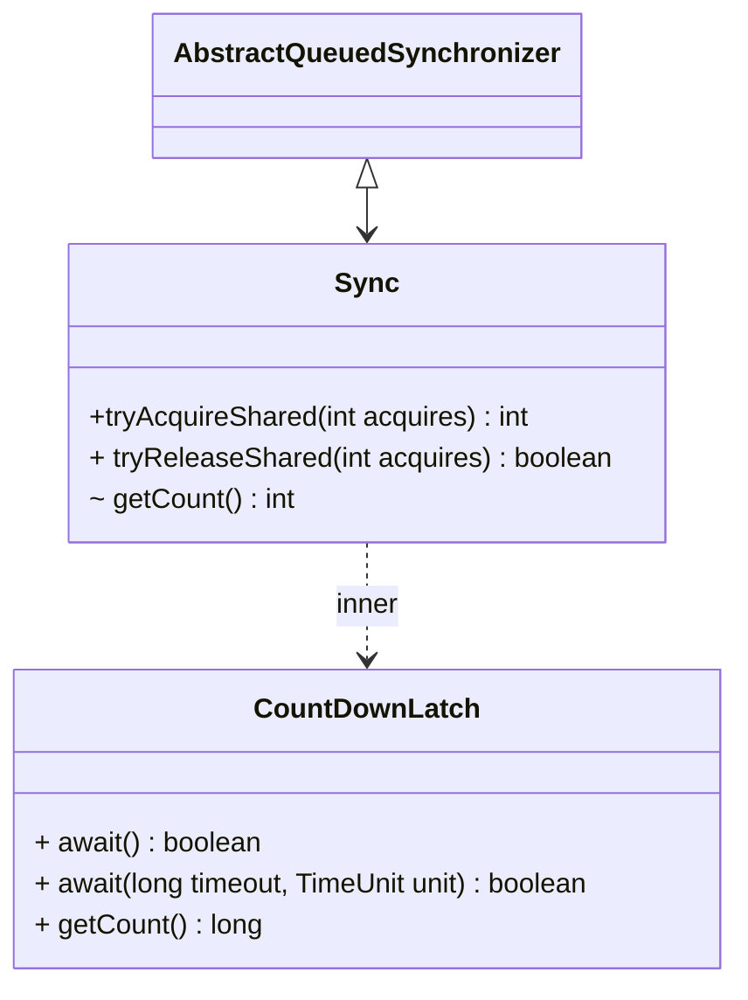

# CountDownLatch

## 使用demo
```java
CountDownLatch countDownLatch = new CountDownLatch(5);  
ThreadPoolExecutor threadPoolExecutor = new ThreadPoolExecutor(5,5,1000, TimeUnit.SECONDS, new LinkedBlockingDeque());  
for(int i=0;i<5;i++){  
    threadPoolExecutor.submit(new Runnable() {  
        @Override  
        public void run() {  
            try {  
                StudentService.getStudentMock();  
                countDownLatch.countDown();  
            } catch (InterruptedException e) {  
                throw new RuntimeException(e);  
            }  
  
        }  
    });  
}  
countDownLatch.await();  
System.out.println("全部启动完成。。。");
```
```
pool-1-thread-4 进入mock
pool-1-thread-5 进入mock
pool-1-thread-3 进入mock
pool-1-thread-2 进入mock
pool-1-thread-1 进入mock
全部启动完成。。。
```
使用countDown来减少技术，await会阻塞当前线程直到CountDownLatch记数为0。
## 原理
```
CountDownLatch countDownLatch = new CountDownLatch(5);
将state设为5，由于state是protected，final方法，所以只能修改一次。CountDwonLatch只能使用一次。
```

```ad-tip
>  通过以下方法简易实现多次使用
>  对于多次使用，可以创建public方法供外部修改state 
>  public void setStateToPub(int state){  
>    setState(state);  
>   }

```
