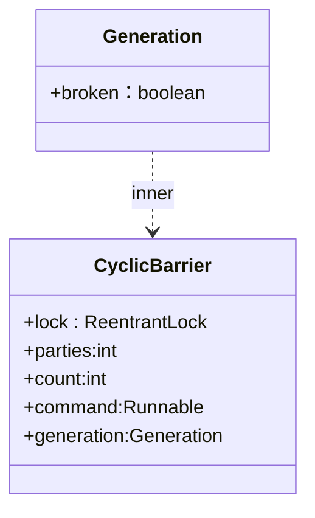

# CyclicBarrier
## 一 介绍
## 二 类图


## 三 使用demo
```java
public static void CBTest(){  
    CyclicBarrier cyclicBarrier = new CyclicBarrier(5, new Runnable() {  
  
        @Override  
        public void run() {  
            System.out.println("元神启动！");  
        }  
    });  
    ThreadPoolExecutor executor = new ThreadPoolExecutor(5,5,100,TimeUnit.MILLISECONDS,new LinkedBlockingDeque<>());  
    for(int i=0;i<5;i++){  
        executor.submit(new Runnable() {  
            @Override  
            public void run() {  
                System.out.println(Thread.currentThread().getName()+"----"+"is ok");  
                try {  
                    Thread.sleep(random.nextInt(10000));  
                    cyclicBarrier.await();  
                } catch (Exception e) {  
                    throw new RuntimeException(e);  
                }  
  
            }  
        });  
    }
```

