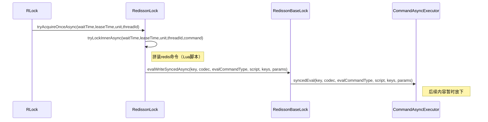

## 三大原则

CAP即：
- **一致性（Consistency）** : 所有节点访问同一份最新的数据副本
- **可用性（Availability）**: 非故障的节点在合理的时间内返回合理的响应（不是错误或者超时的响应）。
- **分区容错性（Partition Tolerance）** : 分布式系统出现网络分区的时候，仍然能够对外提供服务。
## 两大锁
### cp锁
需要加锁时，需要确保半数以上的节点保存下来完成加锁。
优点：
cp锁保证百分百的一致性。
缺点：
cp锁每次加锁都需要对节点进行申请，也就是 时延会较大。
### ap锁
在redis cluster中对键进行加锁，依靠主从同步备份。
优点：
只需要对单机（redis cluster对key加锁后，最终落到一个机器上）的key进行加锁，所以加锁比较快，延迟低。
缺点：
因为主从复制存在延迟，可能存在加锁后，主机宕机从机未复制，会出现错误。
## REDISSON



```lua
if ((redis.call('exists', KEYS[1]) == 0)   
            or (redis.call('hexists', KEYS[1], ARGV[2]) == 1)) then  
        redis.call('hincrby', KEYS[1], ARGV[2], 1); 
        redis.call('pexpire', KEYS[1], ARGV[1]);   
        return nil;   
    end;
    return redis.call('pttl', KEYS[1]);
```


```lua
local val = redis.call('get', KEYS[3]); 
if val ~= false then 
    return tonumber(val);
end; 

if (redis.call('hexists', KEYS[1], ARGV[3]) == 0) then 
    return nil;
end; 
local counter = redis.call('hincrby', KEYS[1], ARGV[3], -1); 
if (counter > 0) then 
    redis.call('pexpire', KEYS[1], ARGV[2]); 
    redis.call('set', KEYS[3], 0, 'px', ARGV[5]); 
    return 0; 
else 
    redis.call('del', KEYS[1]); 
    redis.call(ARGV[4], KEYS[2], ARGV[1]); 
    redis.call('set', KEYS[3], 1, 'px', ARGV[5]); 
    return 1; 
end; 
```
lua脚本中的参数为：
```java
Arrays.asList(getRawName(), getChannelName(), getUnlockLatchName(requestId)),  
LockPubSub.UNLOCK_MESSAGE, internalLockLeaseTime,  
getLockName(threadId), getSubscribeService().getPublishCommand(), timeout
```

在锁被释放后，del了key并且执行了avg4（也就是发布订阅）那么什么是订阅？
先看一下lock的源码
```java
long threadId = Thread.currentThread().getId();  
        Long ttl = tryAcquire(-1, leaseTime, unit, threadId);  
        // lock acquired  
        if (ttl == null) {  
            return;  
        }  
  
        CompletableFuture<RedissonLockEntry> future = subscribe(threadId);  
        pubSub.timeout(future);  
        RedissonLockEntry entry;  
        if (interruptibly) {  
            entry = commandExecutor.getInterrupted(future);  
        } else {  
            entry = commandExecutor.get(future);  
        }  
  
        try {  
            while (true) {  
                ttl = tryAcquire(-1, leaseTime, unit, threadId);  
                // lock acquired  
                if (ttl == null) {  
                    break;  
                }  
  
                // waiting for message  
                if (ttl >= 0) {  
                    try {  
                        entry.getLatch().tryAcquire(ttl, TimeUnit.MILLISECONDS);  
                    } catch (InterruptedException e) {  
                        if (interruptibly) {  
                            throw e;  
                        }  
                        entry.getLatch().tryAcquire(ttl, TimeUnit.MILLISECONDS);  
                    }  
                } else {  
                    if (interruptibly) {  
                        entry.getLatch().acquire();  
                    } else {  
                        entry.getLatch().acquireUninterruptibly();  
                    }  
                }  
            }  
        } finally {  
            unsubscribe(entry, threadId);  
        }  
//        get(lockAsync(leaseTime, unit));  
    }

```

尝试获取锁，如果ttl为null，说明没有这个锁。之后是subscribe(threadId)这就是我们要研究的订阅。


```ad-todo
后续lock的内容
```

**subscribe()**
```ad-tip
涉及到Future/Promise-Listener模型
```
[Future Promise-Listener订阅模型](Future%20Promise-Listener订阅模型.md)
PublishSubscribe:subscribe(entry,channel)
```java
public CompletableFuture<E> subscribe(String entryName, String channelName) {  
	//获取名为channelName的信号量
    AsyncSemaphore semaphore = service.getSemaphore(new ChannelName(channelName));  
    //设置新的promise
    CompletableFuture<E> newPromise = new CompletableFuture<>();  
	//信号量acquire后，执行
    semaphore.acquire().thenAccept(c -> {  
	    //如果newPromise已经结束后，释放信号量，结束
        if (newPromise.isDone()) {  
            semaphore.release();  
            return;  
        }  
		  //获取entry。
        E entry = entries.get(entryName);  
        //如果是entry不为空，获取entry的信号量，释放 semaphore的信号量（轻量锁）
        if (entry != null) {  
            entry.acquire();  
            semaphore.release();  
            //entry进行计算后 查看是否出现问题，如果没有 将结果集设置到newPromise
            entry.getPromise().whenComplete((r, e) -> {  
                if (e != null) {  
                    newPromise.completeExceptionally(e);  
                    return;  
                }  
                newPromise.complete(r);  
            });  
            return;  
        }  
		//entry为空，那就创建entry。
        E value = createEntry(newPromise);  
        value.acquire();  
		//如果entries里面还有值
        E oldValue = entries.putIfAbsent(entryName, value);  
        if (oldValue != null) {  
            oldValue.acquire();  
            semaphore.release();  
            oldValue.getPromise().whenComplete((r, e) -> {  
                if (e != null) {  
                    newPromise.completeExceptionally(e);  
                    return;  
                }  
                newPromise.complete(r);  
            });  
            return;  
        }  
		  //如果entries 设置成功，那就创建linstener，并将entry封装在linstener
		  // linstener，主要是设置onmessgae，如果channelName与名字相同，那就用entry来onmessage。
        RedisPubSubListener<Object> listener = createListener(channelName, value);  
        //
        CompletableFuture<PubSubConnectionEntry> s = service.subscribeNoTimeout(LongCodec.INSTANCE, channelName, semaphore, listener);  
        newPromise.whenComplete((r, e) -> {  
            if (e != null) {  
                s.completeExceptionally(e);  
            }  
        });  
        s.whenComplete((r, e) -> {  
            if (e != null) {  
                entries.remove(entryName);  
                value.getPromise().completeExceptionally(e);  
                return;  
            }  
            value.getPromise().complete(value);  
        });  
  
    });  
  
    return newPromise;  
}
```
